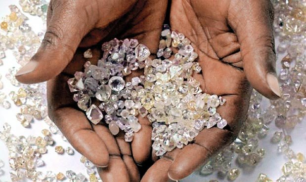

# DiamondsPrediction

“He loved possessions, not masses of them, but a select few that he did not part with. They gave a man self-respect. Not ostentation but quality, and the love that cherished the quality. Possessions reminded him that he existed, and made him enjoy his existence." 
The Talented Mr. Ripley

This is the last proyect for IronHack Analisys Data Camp. 
The goal of the project is to obtain the best prediction of the price of the diamonds according to some features.

You can read the rules here: https://www.kaggle.com/c/diamonds-datamad0620/overview/evaluation

STEPS

I am going to explain every step I try during the proccess of creation of this prediction.

1.- As you can see, the first step consists on create a new repository in github with readme, download the rules and the csv form kaggle and
create the different files to start working with the data. 

2.- Cleaning the train.csv. 
